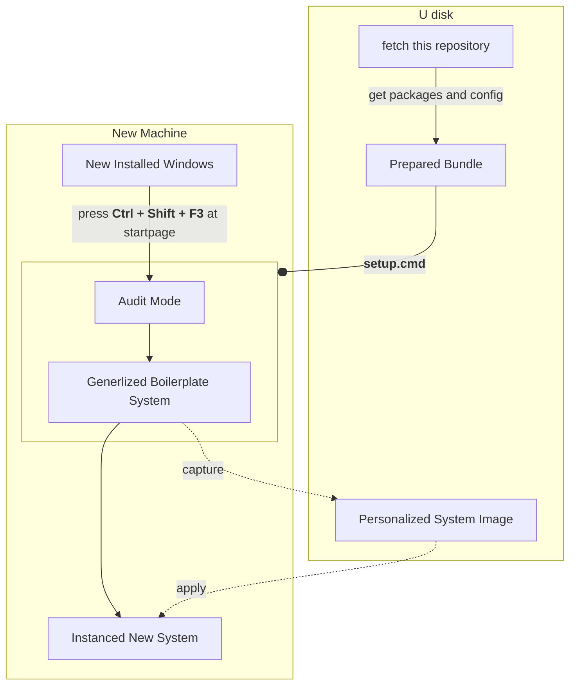
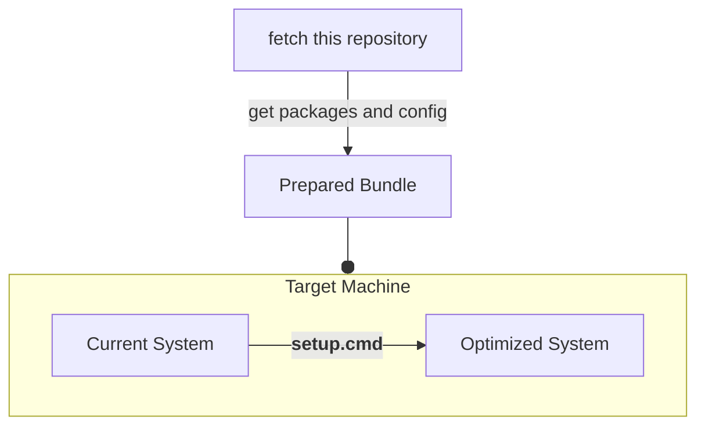

# 🪟 Your Windows System Preparation

Auto setup or config Your Windows by One Click.

Suitable: Win11/Win10, [Win7](./win7/README.md). x64 CPU arch.

This README is also available in languages: [🇨🇳 简体中文](./README_ZH.md)

## 🤔 How To Use?

1. Git clone or download this repository into your U disk.
2. Copy or learn the config files from `samples/`
3. [Enable or tweak features in `configuration.ps1`](./features/README.md)
4. [Add packages into `packages/`](./packages/README.md)

### 🚩 Deploy On New Machine

Please read the documentation: [Audit Mode](https://learn.microsoft.com/en-us/windows-hardware/manufacture/desktop/boot-windows-to-audit-mode-or-oobe)

### ⚙️ Deploy On Existed System

## ⚠️ Warning

DISCLAIMER: You're doing this at your own risk, I am not responsible for any data loss or damage that may occur.

## 🌟 Install a new Windows

Binary Assets ...

 

System Images:

- [Windows 10](https://www.microsoft.com/software-download/windows10)
- [Windows 11](https://www.microsoft.com/software-download/windows11)

Get U disk image writer:

- Ventoy: multi images boot support

  [Official GitHub Release](https://github.com/ventoy/Ventoy/releases/latest)

- Rufus: only single image, more options and better compatibility

  find `*p.exe` at [Official GitHub Release](https://github.com/pbatard/rufus/releases/latest)

 

## 💿 Make and Apply a System Image

Encapsule as an Image ...

 

1.  Generalized shutdown in `sysprep.exe`
2.  Boot into Recovery Mode or WinPE in USB
3.  Check or mount driver letters, list a table:

        echo lis vol | diskpart

4.  Set temporary directory to attain enough disk space:

        set tmp=d:\tmp
        mkdir %tmp%

5.  Capture command: (open README.md by notepad.exe to copy code)

        start cmd /k dism /capture-image /verify /checkintegrity /name:mysys /compress:max /capturedir:c: /imagefile:d:\mywin.esd

| Command Parameters      | Usage                            |
| ----------------------- | -------------------------------- |
| start cmd /k            | run it in new command prompt     |
| /capturedir             | the system partition letter      |
| /imagefile              | type your full backup image path |
| /name                   | customized Name                  |
| /compress               | (optional) max,fast,none         |
| /verify /checkintegrity | (optional)                       |

`.wim` is a legacy compatible and low compression format

`.esd` is the new high compression ratio format with long compression time

 

Restore from an Image ...

 

1.  Boot into Recovery Mode or WinPE in USB
2.  Mount the target system partition as C drive
3.  Restore command: (open README.md by notepad.exe to copy code)

        dism /apply-image /index:1 /verify /applydir:c: /imagefile:D:\backup\system.esd

Attention:

- `/index` should be 1 as default
- optional: `/verify`
- optional: `/compact` slim down system data, from 40G~ to 20G~ as usual

Adding a UEFI boot entry:

<pre><code>mountvol u: /s
bcdboot c:\windows /s u:
</code></pre>

## 🧋 Buy me a coffee

Alipay|WeChat Pay
---|---
|
