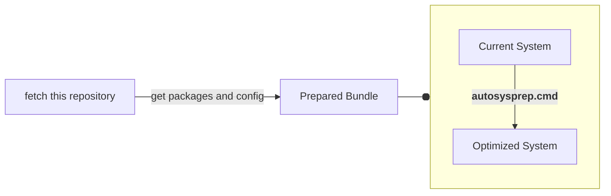
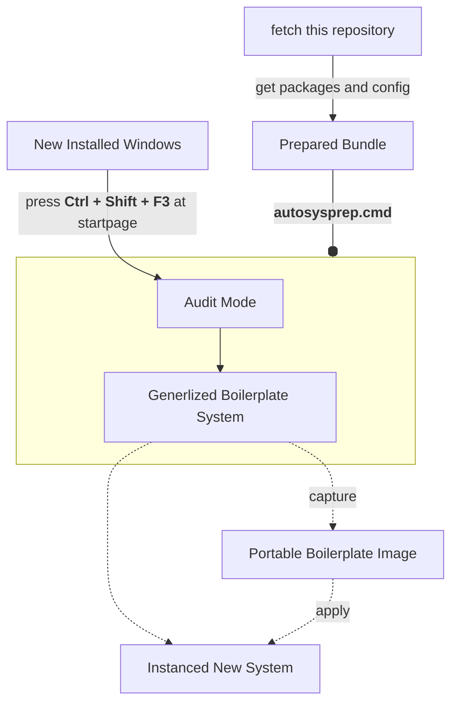

# Windows Setup Framework

Auto setup or config Your Windows by One Click.

## How To Use?

1. git clone or download this repository into your U disk.
2. Get your required packages
3. Verify shasum
4. Get portableapps

## Install a new Windows

Tutorial ...

 

Download system image if required:

[Windows 10](https://www.microsoft.com/software-download/windows10)
|
[Windows 11](https://www.microsoft.com/software-download/windows11)

Get U disk image writer:

- Ventoy: multi images boot support

  [Official GitHub Release](https://github.com/ventoy/Ventoy/releases/latest)

- Rufus: only single image, more options and better compatibility

  find `*p.exe` at [Official GitHub Release](https://github.com/pbatard/rufus/releases/latest)

 

### Deploy On Existed System

### Create Boilerplate System Image

## Get Your Required Packages

Translation: [中文](./docs/i18n/cn/getapps.md)

<b>Show more:</b> recommended softwares ...
 

download into `.\deploy`:

- Firefox: privacy-first browser

  [Download Installer directly](https://download.mozilla.org/?product=firefox-latest-ssl&os=win64)

- Thunderbird: Mozilla free email client

  [Official Download Page](https://www.thunderbird.net/)

- OBS: free live recorder

  [Official Download Page](https://obsproject.com/)

- Everything: file searcher, experience far beyond the system built-in search engine

  Find `Download Lite Installer 64-bit` at [Official Download Page](https://www.voidtools.com)

- mcmilk's improved 7zip: compressor

  Find `.exe` at [Official GitHub Release](https://github.com/mcmilk/7-Zip-zstd/releases/latest)

helper:

- Cyberduck: cloud storage explorer

  [Official Download Page](https://cyberduck.io/download/)

- Workrave: rest reminder

  [Official GitHub Release](https://github.com/rcaelers/workrave/releases/latest)

- qBittorrent: free BitTorrent client

  Find `x64` at [FOSSHUB Release](https://www.fosshub.com/qBittorrent.html)

for developers:

- Chocolatey: Packages Manager

  [Download Installer directly](https://community.chocolatey.org/api/v2/package/chocolatey)

- gsudo: acquire administration privilege

  [Download GitHub Release directly](https://github.com/gerardog/gsudo/releases/latest/download/gsudoSetup.msi)

- Sysinternals: advanced system utilities and technical information

  [Download Content directly](https://download.sysinternals.com/files/SysinternalsSuite.zip)

- Git for Windows

  [Official Download Page](https://gitforwindows.org/)

- PowerShell Core: better than classic PowerShell

  Find `win-x64.msi` at [Official GitHub Release](https://aka.ms/powershell-release?tag=stable)

- gVim: text editor Vim with GUI

  Click "Last modified" and find the latest `.exe` at [Official Download Page](https://ftp.nluug.nl/pub/vim/pc/)

- VirtualBox: free open source virtualization platform by Oracle

  Find `Windows hosts` at [Official Download Page](https://www.virtualbox.org/wiki/Downloads#VirtualBoxbinaries)

- OpenSSH: fix the bug of internal version of SSH

      chan_shutdown_read: shutdown() failed for fd 7 [i0 o0]: Not a socket

  find `OpenSSH-Win64-v` at [Official GitHub Page](https://github.com/PowerShell/Win32-OpenSSH/releases/latest)

- ImDisk Toolkit: ramdisk for Windows and mounting of image files

  [Official Download Page](https://sourceforge.net/projects/imdisk-toolkit/files/latest/download)

### Verification

Excecute `_verify.cmd` in `.\deploy`

### Portable Applications

You can get [Firefox ESR](https://portableapps.com/apps/internet/firefox-portable-esr),
unpack it into current repository

### Miscellaneous

Manuall Installers, put them into `.\misc`

- Brave: Chromium Distribution

  [Get Online Installer](https://laptop-updates.brave.com/latest/winx64)

- VeraCrypt: free hard disk data encryptor

  Find `MSI Installer` at [Official Download Page](https://www.veracrypt.fr/en/Downloads.html)

- OhMyLnk: useful windows shortcuts

  [GitHub Repository](https://github.com/setupfw/ohmylnk)

 

## Get Started

Deploy on the target machine:

1. Enter into the
   [audit mode](https://learn.microsoft.com/en-us/windows-hardware/manufacture/desktop/boot-windows-to-audit-mode-or-oobe)
2. Open this repository with your `.\deploy`
3. Edit `config.ps1` or `Copy-Item .\samples\config-*.ps1 .`
4. Execute `autosysprep.cmd`
5. Check files of `.\misc` if required

## Warning

⚠️ DISCLAIMER: You're doing this at your own risk, I am not responsible for any data loss or damage that may occur.
