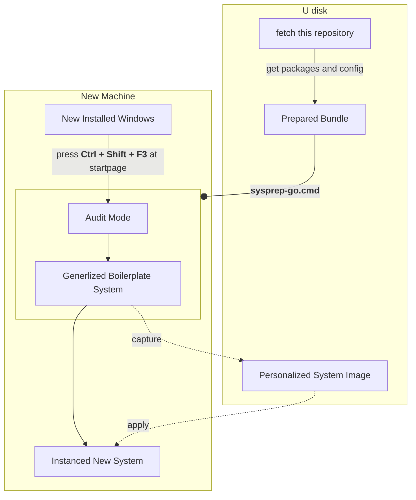
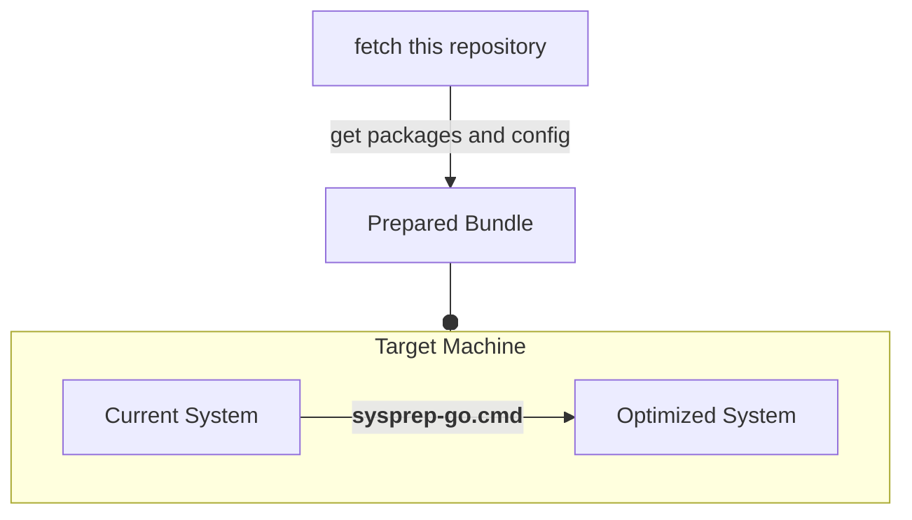

# Windows Setup Framework

Auto setup or config Your Windows by One Click.

This README is also available in: [中文](./README_ZH.md)

Suitable: Win11/Win10, [Win7](./win7/README.md). x64 CPU arch.

## How To Use?

1. Git clone or download this repository into your U disk.
2. Copy or learn the config files from `samples/`
3. [Enable or tweak features in `config.ps`](./features/README.md)
4. [Add packages into `packages/`](./packages/README.md)

### Deploy On New Machine

Please read the documentation: [Audit Mode](https://learn.microsoft.com/en-us/windows-hardware/manufacture/desktop/boot-windows-to-audit-mode-or-oobe)

### Deploy On Existed System

## Warning

⚠️ DISCLAIMER: You're doing this at your own risk, I am not responsible for any data loss or damage that may occur.

## Install a new Windows

System Images:

- [Windows 10](https://www.microsoft.com/software-download/windows10)
- [Windows 11](https://www.microsoft.com/software-download/windows11)

Get U disk image writer:

- Ventoy: multi images boot support

  [Official GitHub Release](https://github.com/ventoy/Ventoy/releases/latest)

- Rufus: only single image, more options and better compatibility

  find `*p.exe` at [Official GitHub Release](https://github.com/pbatard/rufus/releases/latest)

## Advanced Development Tools

See `tools/`
