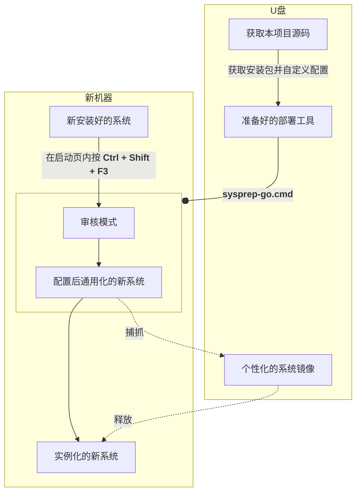
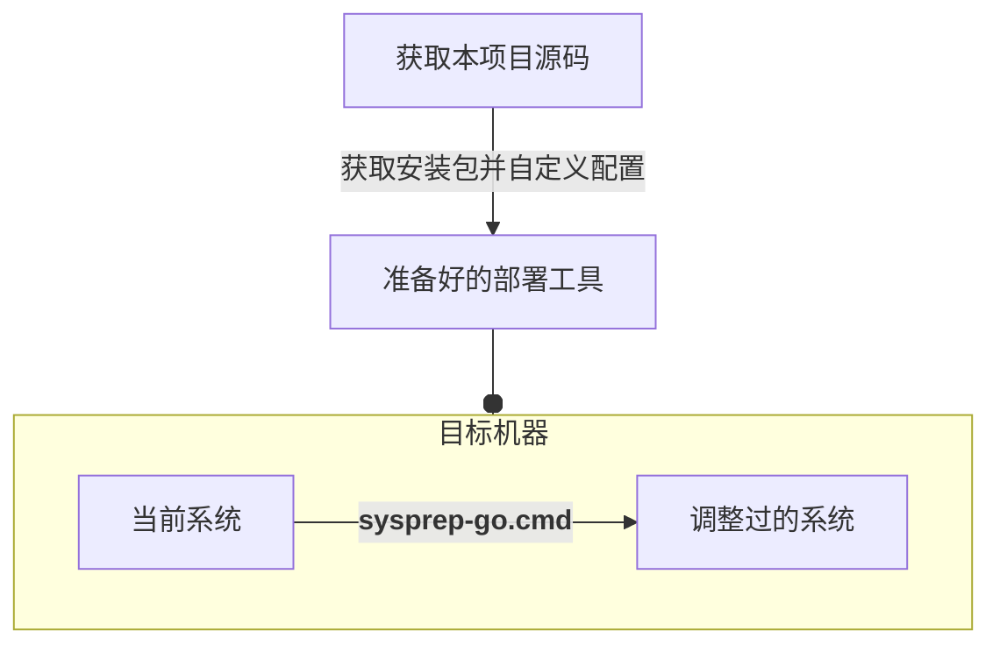

# Windows 一键部署脚手架

适用于：Win11/Win10

## 使用方法

1. 克隆本项目代码到 U 盘内
2. 参考或复制 `samples/` 目录内的配置文件
3. [修改 `config.ps` 激活/配置所需特性](./features/README_ZH.md)
4. [添加安装包到 `packages/` 目录内](./packages/README_ZH.md)

### 部署到新机器上

请先阅读相关说明：[审核模式](https://learn.microsoft.com/en-us/windows-hardware/manufacture/desktop/boot-windows-to-audit-mode-or-oobe)

### 部署到现有系统上

## 免责声明

⚠️ 使用本软件存在用户个人数据丢失的风险，使用本功能前，用户应对重要数据进行备份。因用户未能进行充分备份而导致的任何硬盘数据损失，作者不承担任何赔偿责任。

## 安装新 Windows 系统

获取安装资源 ……

 

下载系统镜像：

- [Windows 10](https://www.microsoft.com/zh-cn/software-download/windows10)
- [Windows 11](https://www.microsoft.com/zh-cn/software-download/windows11)

获取 U 盘刻录器：

- Ventoy: 多镜像启动支持

  [南京大学镜像站](https://mirrors.nju.edu.cn/github-release/ventoy/Ventoy)

- Rufus: 仅单一镜像，但选项更多、兼容性更好

  找到 `Portable Version` 下载，[FOSSHub](https://www.fosshub.com/Rufus.html)

获取分区辅助工具：

- DiskGenius

  找到 `单文件PE版` 并选兼容旧电脑的 32 位版本，
  见[官方下载页](https://www.diskgenius.cn/download.php)

- [傲梅分区助手](https://www2.aomeisoftware.com/download/pacn/%E5%88%86%E5%8C%BA%E5%8A%A9%E6%89%8BPE.exe)

干净的 WinPE:

- [微 PE 工具箱](https://www.wepe.com.cn/ubook/start.html)
- [优启通 EasyU](https://www.upe.net/)

## 制作并使用系统镜像

封装为新镜像……

 

1.  使用 `sysprep.exe` 通用化封装后关机
2.  进入恢复模式或从 USB 启动 WinPE
3.  检查或挂在盘符，列出盘符表：

        echo lis vol | diskpart

4.  设置足量的存储空间作暂存区：

        set tmp=d:\tmp
        mkdir %tmp%

5.  打包为新镜像：

        start cmd /k dism /capture-image /capturedir:c: /imagefile:D:\mywin.esd /name:mysys /compress:max /checkintegrity /verify

| Command Parameters | Usage                            |
| ------------------ | -------------------------------- |
| start cmd /k       | run it in new command prompt     |
| /capturedir        | the system partition letter      |
| /imagefile         | type your full backup image path |
| /name              | customized Name                  |
| /compress          | optional: max,fast,none          |
| /checkintegrity    | /verify optional: verify         |

`.wim` is a legacy compatible and low compression format

`.esd` is the new high compression ratio format with long compression time

从镜像中恢复……

 

1.  进入恢复模式或从 USB 启动 WinPE
2.  建议把目标的系统分区挂载为 C 盘
3.  执行恢复指令：

        dism /apply-image /index:1 /verify /applydir:c: /imagefile:D:\backup\system.esd

注意事项：

- `/index` 一般必填 1
- 可选参数：`/verify` 输出错误信息
- 可选参数：`/compact` 安装时压缩 C 盘系统占用空间，约从 40G~ 降到 20G~

添加 UEFI 启动项：

<pre>
<code>mountvol u: /s
bcdboot c:\windows /s u:
</code></pre>

可选 ）添加第二个 Windows 系统分区：

<pre>
<code>bcdboot d:\windows /s u: /d /addlast</code>
</pre>

## 二次开发的技巧

内容请见 `tools/`
